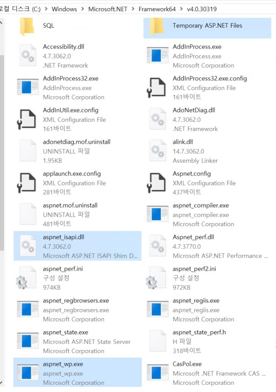
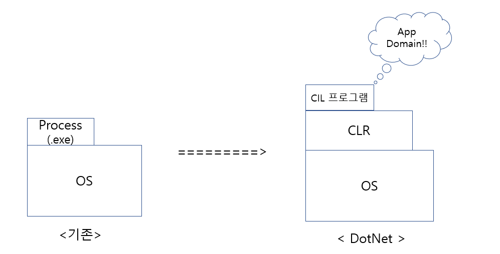

### .net framework / .net core
    * 닷넷 프레임워크 : 윈도우 전용
    * 닷넷 코어 : 멀티 플랫폼
    
#### .NET Framework
    * Windows 전용
    * .NET Framework 대표 라이브러리 - WPF, Windows Forms, ASP.NET을 사용하여 Windows 응용 프로그램 빌드 가능
#### .Net Core
    * 윈도우, 리눅스, macOS 사용 가능
    * UWP 및 ASP.NET Core 만 지원
    * 클라우드 사용과 인터넷 연결 앱을 만들기 위한, 브라우저 기반 웹 응용 프로그램 작성에 용이
    * Razor Page 지원
    * 경량화로 인해 가벼움
    * Docker 사용 가능
#### Xamarin
    * 모바일 환경에 제한된 기능
    * Android, IOS, Window mobile 등 지원

### Entity Framework
    * Database First 방식: 데이터베이스 테이블을 이용해서 데이터 모델 객체 자동 생성 : 테이블 생성 -> (Visual Studio에) 테이블 정보 불러오기 -> C# 클래스 생성
    * Model First: 데이터모델 객체를 정의하고 모델을 이용해서 데이터베이스에 테이블 자동 생성: (Visual Studio에서) Model들의 관계 설정 -> C# 클래스와 테이블 생성
    * Code First: C# 클래스 작성 -> Table 생성

    * .NET 전용 ORM(객체 관계 맵핑 Object- relational mapping) 프레임워크
    * EDM(entity data model) 을 만들고 LINQ를 이용해서 데이터 접근 가능
    * 데이터 테이블 구조를 클래스화 시키고 각 객체에 데이터를 맵핑시키는 기술
    * 단점: DB 성능을 기대하기 어려움

#### IIS Architecture
    * aspnet_isapi.dll : ASP.NET ISAPI Extension
    * aspnet_wp.exe    : ASP.NET 작업자 프로세스 (Worker Process)
    * 설치 패키지는 컴퓨터상의 Users 그룹 내에 ASPNET 이라는 로컬 사용자 계정을 생성한다. 기본적으로 ASPNET의 작업자 프로세스(aspnet_wp.exe)는 이 계정을 사용하여 구동되는데, 프로세스에 최소한의 권한을 가진 계정을 부여함으로써 보안을 강화하기 위한 것이다.
        + IIS 6.0 에서 작업자 프로세스는 w3wp.exe

    * IIS 가 .aspx 파일에 대한 요청을 받으면 응용 프로그램의 스크립트 맵은 해당 .aspx 파일을 적절한 버전의 ASP.NET ISAP 확장에 전달하도록 IIS에 지시한다

    * 클라이언트의 모든 HTTP 요청은 IIS 의 실행 프로세스인 inetinfo.exe 가 받아 들인다. inetinfo 는 요청 리소스의 형식을 확인하여 확장자와 매핑 되어있는 ISPI Extension 모듈로 요청을 전달한다
    * aspnet_isapi.dll 은 닷넷 웹 리소스를 직접 처리하지 않고 ASP.NET Worker Process 인 aspnet_wp.exe 로 요청을 전달하는 dispatcher 로서 역할을 수행한다
    * aspnet_isapi.dll과 aspnet_wp.exe 사이의 연결은 Win32 메커니즘인 명명 파이프를 통해 이루어진다.
    * ASP.NET Worker Process 인 aspnet_wp.exe 는 닷넷공용언어런타임(CLR)을 호스트하며 HTTP 파이프라인을 활성화하여 웹리소스의 실제 처리를 시작한다.
    * 각 웹 응용 프로그램들은 Worker Process 의 가상 디렉터리로 식별되며, AppDomain 이라는 응용프로그램 도메인에 속하게 된다.
        - 응용프로그램 설정(Application, Session, Cache 등) 은 공유되지 않는다.
        - AppDomain (Application Domain)
            + 닷넷, 즉 CLR 위에서 돌아가는 논리적인 프로세스
            + CIL (Common Intermediate Language) : DotNet Framework 에서 실행되는 언어. C# 으로 짜여진 소스코드를 컴파일하면 바로 바이너리 파일로 나오는 것이 아니고 CIL로 쓰여진 파일이 나온다
            + CLR (Common Language Runtime) : 자바의 JVM 처럼 C# 등 DotNet 언어로 작성된 프로그램이 어느 OS 위에서든 실행 되도록 하기 위한 가상 실행 환경으로, 이 때 프로그램은 CIL로 작성된 프로그램이다.
              DotNet 의 논리적인 프로세스인 App Domain 을 OS 가 인식할 수 있는 물리적인 프로세스 - 실제 바이너리 파일(.exe) 로 변환시켜준다.
              App Domain 들은 CLR 이 관리하기 때문에 OS 는 이들을 직접 보지 못하고 CLR 이 보여주는대로만 볼 수 있다.
              (그림2 참고)
            
    * 모든 활성 웹 응용프로그램들은 하나의 Worker Process 에서 호스트한다.
      (그림1 참고)
[Reference: https://m.blog.naver.com/saltynut/120025752556](https://m.blog.naver.com/saltynut/120025752556)   
[Reference: https://moonan90.tistory.com/42](https://moonan90.tistory.com/42)

[그림1]  

[그림2]  
[Reference](https://korsa.tistory.com/17) 

